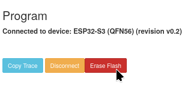
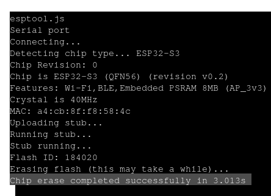
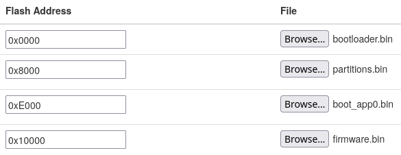

  <h1><strong>INTRODUCTION</strong></h1>

---
The Pocket Dongle S3 is a clone of the Lilygo T-Dongle S3. It was supposed to be a cheap clone of the Lilygo, but turned out to have better raw hardware onboard. The official build of the USBArmyKnife does support the Pocket Dongle S3, but only by using the _generic_ ESP32 S3 build that is provided alongside the 6 other builds, _yuck_. The other devices have the firmware built completely around them, _all except the Pocket Dongle S3_. So I took matters into my own hands and strapped together a new firmware with support for the 16MB Flash Storage and more importantly, the _8MB of PSRAM_ that it features. _What will you do with 2x the storage and approx. 25.6x of PSRAM?_ It's all up for you to decide!

  <h1><strong>COMPATIBILITY</strong></h1>

---

Pocket-Dongle-S3 N16R8 **ONLY!!**

Buy from 'GNPE Development Board Factory' Store on AliExpress.

Link: https://www.aliexpress.com/item/1005009024098181.html?spm=a2g0o.order_list.order_list_main.22.5efa18026bG7NB 

  <h1><strong>COMPARISON</strong></h1>

---

_bold text means better_

| Spec | Pocket Dongle S3 (N16R8) | Lilygo T-Dongle S3 |
| :--- | :---: | :---: |
| SoC | ESP32-S3 | ESP32-S3 |
| Flash Storage | 16MB | 16MB |
| RAM | **8MB PSRAM + 512KB SRAM** | No PSRAM + 512KB SRAM |
| Display | 0.96' 160x80 65k Color LCD  | 0.96' 160x80 65k Color LCD |
| Manufacturer | GNPE Development Board Factory | lilygo Official Store |
| Price | **€11.62** | €16.43 |

  <h1><strong>HOW TO INSTALL</strong></h1>

---

_go to this page first: https://espressif.github.io/esptool-js/ , when doing any step, allow whatever permissions the site asks for and whatever add-ons it wants to install_

## Step One - **Wipe**
* Under '**Program**' select '**Baudrate:**' and set it to 115200 via the dropdown menu, now hold the 'Boot' button on your device and plug it in, **only stop holding when the computer detects it** then press the blue 'Connect' button and Allow the browser access to your device.

* You'll see a red '**Erase Flash**' button, click it.

* After clicking it, look at the end of the black console for a '`Chip erase completed successfully in 3.0s`'

* _Wipe complete!_ Now disconnect the device and refresh the web page.

## Step Two - **Install**
* After refreshing the page, select a Baudrate of 115200, hold the 'Boot' button on your device and plug it in, **only stop holding when the computer detects it** then press Connect and Allow the browser access to your device.

* Look under the '**Flash Address**' text, you'll see a box with the text '0x1000', remove it and in its place type '_0x0000_', then look to the right, under '**File**', click '**Browse...**', open the extracted folder containing all the bin files and _only select_ '**bootloader.bin**', then press the blue button saying '**Add File**' TWICE. On the second Address, type '_0x8000_' and add the file named '**partitions.bin**', then on the last address, type '_0x10000_' (**NOT** 0x1000) and add the last file named '**firmware.bin**'.

* _Overview_:

_leave the flash mode/frequency/size options as they are_

* Then simply press the blue button '**Program**' that's near the console and wait till it says '`Wrote 2310512 bytes (1540648 compressed) at 0x10000 in 12.405 seconds.
File  md5: 40a42ecc663aee1d6b8473f653ef63bf
Flash md5: 40a42ecc663aee1d6b8473f653ef63bf
Hash of data verified.
Leaving...
Hard resetting via RTS pin...`'. When it does, wait 5 seconds, unplug the device and close the page.

## Congratulations, device flashed successfully!
To boot into USBArmyKnife, just plug the device into any USB port that has power and see that it's booted on the LCD. To control it, open the Wi-Fi settings on a Smart Watch/Phone/Tablet/Computer and look for a network named '**iPhone14**' (_yes, really_), connect to it and use the password '**password**', then open a web browser and in the URL Bar (**NOT Search Bar**) type '**4.3.2.1:8080**' and you're in, _enjoy_!

## Plans for the future:
* Add a second bar in the Web UI that shows PSRAM Usage alongside the internal SRAM Usage.

* Something else that **really** emphasizes the bigger storage and more PSRAM.

Check out the original project by i-am-shodan: https://github.com/i-am-shodan/USBArmyKnife/tree/master

𝗥𝗲𝗮𝗰𝗵 𝗼𝘂𝘁 𝘁𝗼 "𝗱𝗮𝗻𝗶𝗲𝗹.𝗻𝟭𝟲𝗿𝟴𝗱𝗲𝘃𝗲𝗹𝗼𝗽𝗺𝗲𝗻𝘁@𝗴𝗺𝗮𝗶𝗹.𝗰𝗼𝗺" 𝗶𝗳 𝘆𝗼𝘂 𝗽𝗿𝗼𝘃𝗶𝗱𝗲 𝗳𝗲𝗲𝗱𝗯𝗮𝗰𝗸. 𝗧𝗵𝗮𝗻𝗸 𝘆𝗼𝘂.
